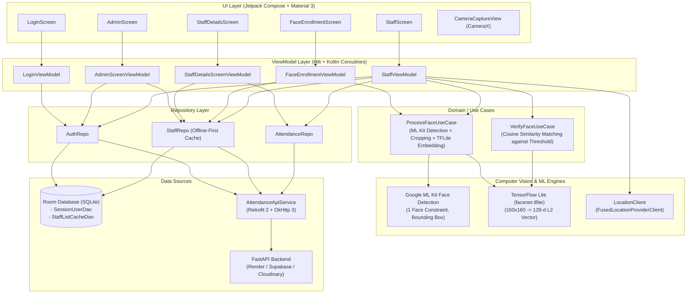

# Attendance App — Android Client

A modern Android attendance application built with **Jetpack Compose**, **Kotlin**, **MVVM architecture**, and **on-device computer vision** (Google ML Kit Face Detection + TensorFlow Lite FaceNet). The app provides role-based access for Administrators and Staff members, enabling biometric face enrollment, on-device facial recognition matching, GPS geotagging, and offline-first data caching.

---

## 1. Technology Stack & Architecture

### Architecture Overview

The project adheres to the **MVVM (Model-View-ViewModel)** architectural pattern with **Unidirectional Data Flow (UDF)**. 

> [!NOTE]
> **Architecture Decision: MVVM over MVI**  
> I deliberately chose **MVVM** for this application to keep boilerplate code minimal and the state management requirements of this use case were not very complex so added boilerplate for **MVI** pattern was not needed. While I personally prefer **MVI** for large-scale, complex production applications.



### Core Technologies Used

| Category | Library / Framework | Purpose |
|---|---|---|
| **Language & Platform** | Kotlin 2.1 (Min SDK 30, Target SDK 37) | Modern Android runtime with coroutines and serialization |
| **UI Toolkit** | Jetpack Compose (BOM 2024.09.00) + Material 3 | Declarative UI, dynamic theming, and reactive components |
| **Navigation** | AndroidX Navigation 3 (`navigation3-runtime`, `navigation3-ui`) | Type-safe sealed class navigation with `rememberNavBackStack` |
| **Dependency Injection** | Dagger Hilt 2.51.1 + KSP | Singleton services, scoped ViewModels, repository injection |
| **Face Detection** | Google ML Kit Face Detection (`com.google.android.gms:play-services-mlkit-face-detection`) | On-device face detection, bounding box extraction, and multi-face validation |
| **Face Recognition** | TensorFlow Lite (`org.tensorflow:tensorflow-lite:2.16.1`) + `facenet.tflite` | 160x160 RGB input preprocessing, float normalization, 128-d L2-normalized embeddings |
| **Verification Metric** | Cosine Similarity (Dot Product on Unit Vectors) | Real-time on-device biometric comparison against enrolled threshold |
| **Camera Integration** | CameraX (`camera-camera2`, `camera-lifecycle`, `camera-view`) | Front-facing camera preview, custom face oval overlay, high-res selfie capture |
| **Local Persistence** | Room 3 (`androidx.room:room-runtime`, `room-ktx`) | Offline-first caching of staff directory, active user session, and face embeddings |
| **Networking** | Retrofit 2.11.0 + OkHttp 3.12.0 + Logging Interceptor | Type-safe REST client for backend communication |
| **Serialization** | Kotlinx Serialization JSON (`kotlinx.serialization.json:1.7.3`) | Fast, compiler-generated JSON parsing |
| **Location** | Google Play Services Location (`play-services-location`) | `FusedLocationProviderClient` for GPS coordinates on check-in |
| **Image Loading** | Coil Compose (`io.coil-kt:coil-compose:2.7.0`) | Asynchronous network image loading for attendance selfies |

### Key Architectural Patterns & Best Practices

The codebase incorporates several proven software engineering patterns designed to keep the system robust, testable, and responsive:

#### 1. Domain Use Cases (`ProcessFaceUseCase`, `VerifyFaceUseCase`)
- **Encapsulation of Complex Business & ML Logic:** Rather than coupling camera processing, face detection, bounding-box math, and model inference directly inside the `ViewModel` or UI layer, these responsibilities are cleanly factored into dedicated use cases:
  - [`ProcessFaceUseCase`](app/src/main/java/com/example/attendanceapp/domain/usecase/ProcessFaceUseCase.kt): Orchestrates ML Kit face detection, enforces business rules (e.g., rejecting frames with zero or multiple faces), applies aspect-ratio margins for facial cropping, and invokes the TFLite interpreter to produce normalized embeddings.
  - [`VerifyFaceUseCase`](app/src/main/java/com/example/attendanceapp/domain/usecase/VerifyFaceUseCase.kt): Computes cosine similarity between live and enrolled vectors and evaluates them against the threshold.
- **Single Responsibility & Reusability:** Both the Admin enrollment flow (`FaceEnrollmentViewModel`) and the Staff attendance check-in flow (`StaffViewModel`) reuse `ProcessFaceUseCase`, eliminating algorithmic duplication and simplifying isolated unit testing.

#### 2. Offline-First Repository Pattern (Staff List & Session Caching)
- **Single Source of Truth (SSOT):** The UI never queries the network directly for rendering. Instead, [`StaffRepo`](app/src/main/java/com/example/attendanceapp/data/repository/StaffRepo.kt) exposes reactive Kotlin `Flow<List<StaffListCache>>` streams backed directly by Room SQLite (`StaffListCacheDao`).
- **Instant UI Rendering:** When the admin opens the application, cached staff records are rendered instantly from the local database with zero network delay or blank loading states.
- **Background Synchronization:** A background sync call (`refreshStaffList()`) queries the backend REST API and updates the local Room database. The reactive `Flow` automatically emits the freshest data to the UI.
- **Biometric Session Caching:** When a staff member logs in, their profile and enrolled facial embedding are cached in [`SessionUserDao`](app/src/main/java/com/example/attendanceapp/data/dao/SessionUserDao.kt), enabling subsequent check-in verifications to run locally without refetching biometric data over the network on every app launch.

---

## 2. Demo Credentials

The application is pre-configured with demo accounts on the backend. You can log into the app using any of the following credentials:

### Admin Credentials

| Role | Username | Password | Purpose |
|---|---|---|---|
| **Admin** | `admin` | `admin123` | Manage staff directory, enroll/re-enroll staff faces, view staff attendance history & selfies |

### Sample Staff Credentials

| Role | Username | Password | Staff ID | Face Enrolled Status |
|---|---|---|---|---|
| **Staff** | `Alice_Smith_101` | `Alice_Smith_101` | `101` | **Enrolled** (ready for attendance check-in) |
| **Staff** | `Bob_Jones_102` | `Bob_Jones_102` | `102` | **Not Enrolled** (prompts admin enrollment) |
| **Staff** | `Charlie_Brown_103` | `Charlie_Brown_103` | `103` | **Enrolled** (ready for attendance check-in) |

---

## 3. Format of Credentials for Newly Added Staff

When an Administrator adds a new staff member through the Admin Screen (`+ Add Staff` dialog):
- The admin provides the staff member's **Full Name** (e.g., `John Doe`) and numeric **Staff ID** (e.g., `104`).
- The backend automatically creates and derives both the **Username** and initial **Password** using the standard format:

$$\text{Username} = \text{Password} = \langle\text{Name with Spaces Replaced by Underscores}\rangle\_\langle\text{Staff ID}\rangle$$

### Examples:

| Staff Name Input | Staff ID Input | Generated Username | Generated Password |
|---|---|---|---|
| `John Doe` | `104` | `John_Doe_104` | `John_Doe_104` |
| `David Miller` | `205` | `David_Miller_205` | `David_Miller_205` |
| `Priya Sharma` | `312` | `Priya_Sharma_312` | `Priya_Sharma_312` |

> [!TIP]
> The derived credentials can be immediately used on the Login screen to access the Staff portal. If the new staff member has not yet had their face enrolled, the app will advise them to have the Admin enroll their face first.

---

## 4. Assumptions Made So Far

The following assumptions and trade-offs have been intentionally adopted in the current implementation:

1. **Minimal Authentication Flow:**  
   We are keeping Auth minimal for now with no session tokens (JWT, refresh tokens, or bearer headers). A successful login stores the authenticated user's ID, name, and role in local Room storage (`SessionUser`), and subsequent API calls rely on direct entity identification.

2. **Coupled User and Staff DB Tables:**  
   We are coupling the users table with the staff table in the database as having them separate for now doesn't really solve any problem for this scope. In production, we would want to separate the authentication credentials and session management from business domain data like biometric embeddings and employee details.

3. **Client-Side Face Recognition:**  
   We are running the face recognition flow to mark attendance client-side (on Android via TensorFlow Lite and ML Kit) rather than server-side, as this assignment is specifically oriented towards demonstrating Android on-device ML capabilities. In production, we would want to perform recognition on the server rather than Android for multiple reasons including tamper resistance, anti-spoofing security, model confidentiality, and centralized performance optimization.

4. **Single-Image Enrollment:**  
   We will just be using a single image to enroll a staff member's face to keep stuff simple for now. In production, we would want to capture multiple pictures under varying lighting conditions, angles, and expressions, and compute an averaged, centroid embedding vector to maximize matching accuracy and minimize false rejection rates.

---

## 5. Key Application Features & Flows

### 1. Administrator Flow
- **Staff Directory (Offline-First):** Displays all registered employees with live search/refresh. Staff data is saved directly in Room (`StaffListCacheDao`) and updated whenever network data arrives.
- **Add Staff:** Modal dialog to enter employee name and numeric ID. Automatically derives login credentials and registers the user.
- **Face Enrollment:** Launches the camera with a circular face guide. Validates that exactly one face is detected via Google ML Kit, crops the face with padding margin, generates a 128-dimensional embedding via FaceNet, and pushes it via `PUT /staff/{id}/embedding`.
- **Attendance Inspector:** Admin can select any staff member to view their complete attendance history, check-in timestamps, GPS coordinates, and view the high-resolution selfie captured during check-in via Cloudinary CDN.

### 2. Staff Flow
- **Authentication & Embedding Sync:** On login, the app checks if the staff member's face embedding is cached locally in Room. If missing, it fetches the enrolled embedding from `GET /staff/{id}/embedding` for instantaneous on-device verification.
- **Biometric Check-In:**
  1. Opens front-facing camera with a face oval guide.
  2. Google ML Kit validates that a clear, single face is in view.
  3. The cropped facial region is preprocessed (scaled to $160 \times 160$, normalized to $[-1, 1]$) and evaluated by the FaceNet TFLite interpreter.
  4. Calculates Cosine Similarity between live selfie embedding and the enrolled embedding:
     $$\text{Similarity}(E_1, E_2) = \frac{E_1 \cdot E_2}{\|E_1\| \|E_2\|} = \sum_{i=1}^{128} E_{1,i} \cdot E_{2,i}$$
  5. If $\text{Similarity} \ge 0.40$ (threshold), verification succeeds.
  6. The app retrieves real-time GPS coordinates via `FusedLocationProviderClient` and uploads the selfie along with timestamp and coordinates via `POST /attendance`.
- **Attendance History:** Staff can view their personal check-in logs and timestamps.

---

## 6. How to Build & Run

### Prerequisites
- **Android Studio:** Ladybug (2024.2.1) or newer
- **JDK:** Java 17 or Java 21
- **Device / Emulator:** Android 11+ (API Level 30+), with Camera and Location permissions enabled. A physical device is recommended for testing live face capture and GPS.

### Build Instructions

1. Clone the repository:
   ```bash
   git clone https://github.com/Rajat352/Attendance-App.git
   cd Attendance-App
   ```

2. Open the project in Android Studio. Gradle will sync dependencies automatically.

3. Backend API Configuration:
   The backend URL is configured in `app/build.gradle.kts`:
   ```kotlin
   buildConfigField("String", "BASE_URL", "\"https://attendance-app-backend-b1n5.onrender.com/\"")
   ```
   By default, it connects to the live deployed Render backend. To point to a local backend, update the URL to your local machine's IP (e.g., `http://10.0.2.2:8000/` for Android Emulator or `http://192.168.x.x:8000/` for a physical device).

4. Build and Run:
   - Select your target device/emulator in Android Studio and press **Run 'app'** (`Shift + F10`), or build from CLI:
     ```bash
     ./gradlew assembleDebug
     ```
